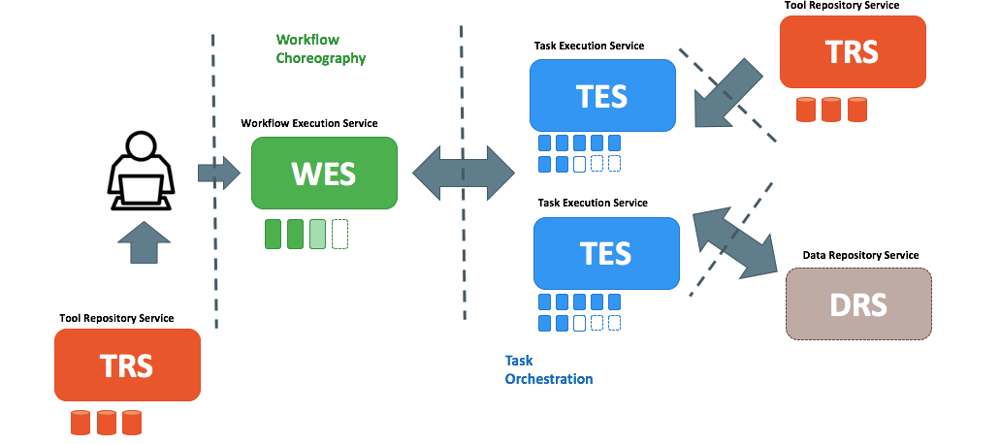
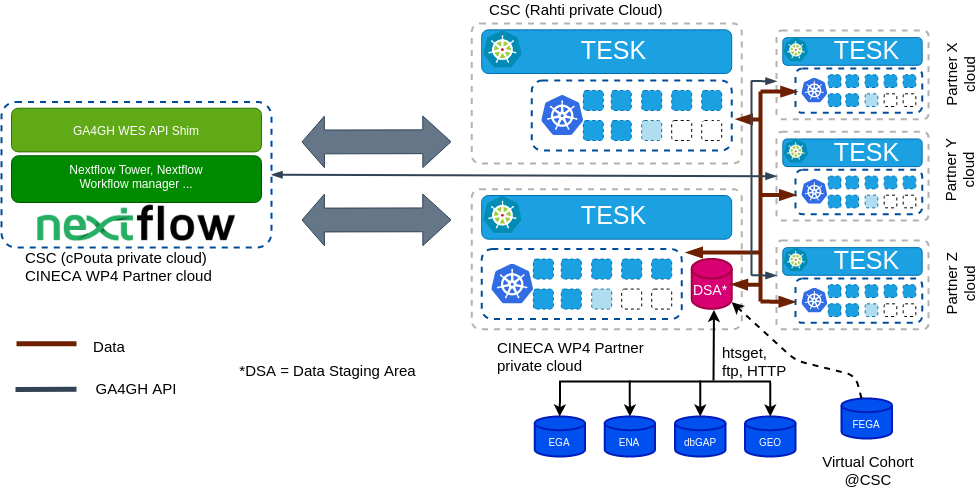
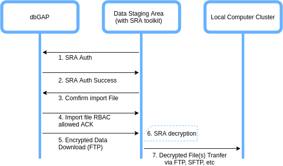

# Framework and APIs for executing federated genomics analyses

## Table of Contents

- [Scope](#scope)
- [Background](#background)
- [Proposed Framework and APIs](#proposed-framework-and-apis)
- [Deployment Scenarios](#deployment-scenarios)
- [PoC Development and User story](#poc-development-and-user-story)
- [Abbreviations and terminoligy](#abbreviations-and-terminoligy)
- [Data Workflow Survey](#Data-Workflow-Survey)

## Scope

The main scope of this deliverable is to gather technical requirements and frameworks for a federated analysis platform. In the work package subtask number 4.3.2, the project partners have described mainly the following use cases:

- A federated QTL analysis for molecular phenotypes.
- A simple Workflow for Polygenic Risk Scores (PRS) across two similar ethnic background sample sets.
- A federated joint cohort genotyping.

The federated analysis platform defined by this task aims to provide technological solutions for these use cases. For doing so, technical requirements are gathered based on these use case descriptions. The aim of this deliverable is to write a short design document that shows the requirements, and lists the different options for a solution.

## Background

As a starting point for this deliverable, a data workflow survey for work package partners was performed. See below in the "[Data Workflow Survey](#Data-Workflow-Survey)" section the questions and all answers. A total of 6 work package partners participated in the survey:

- HES-SO & SIB, Switzerland
- University of Tartu, Estonia
- University Medical Center Groningen (BIOS), Netherlands
- University of Oxford, UK
- University of Cape Town, South Africa
- EGA group, EMBL-EBI, UK

The survey showed that the data sources needed for the analysis varies a lot between sites. There are four data storage archives (see [Table 1](#table-1:-data-workflow-survey-summary)) that are used for accessing the data. However, according to the survey there are similarities in the overall architecture of computing environments used for the analysis (see [Figure 1](#figure-1:-data-workflow)). Usually the data is fetched from the data storage and placed in an internal storage system, that is then accessed by the computing cluster nodes. It is very rare to stream the data directly from the data storage archive, e.g. using the 'htsget' streaming protocol. In most cases data transfer happens using traditional and common transfer protocols, like http(s) or (s)ftp. Also both the data and the file types vary a lot, this limits the transfer protocols to traditional ones. Data types include mostly genome sequences, and phenotype data, but also basically any other data type from presentation files to text documents.

### Table 1: Data workflow survey summary

| Parameters | Responses  |
|:--------|:---|
| **Datatypes** | Genome sequences (whole genomes, exomes, chip data), phenotype data (demographics, disease status, medication), metadata, other data types (documents, presentations, images)  |
| **File formats**  | CRAM, BAM/SAM, FASTQ (data), VCF (data), TAB-delimited data (data), CSV (data), Tabix-indexes (data), DATS/DataMed (metadata) DCAT (metadata), XML (meadata)  |
| **Data storage**  | EGA (controlled access), dbGap (controlled access), ENA (open access), GEO (open access)  |
| **Transfer protocol**   |  http(s) (manual), (s)ftp (manual), Globus (manual), Aspera (manual), htsget (automated)  |
|  **Access rights**|  Per-user basis (no external access), token based (ELIXIR AAI, Switch AAI)  |

### Figure 1: Data workflow

## Proposed Framework and APIs

Based upon extensive discussion on survey results between the CINECA WP4 partners, it was decided that the APIs of the proposed solution should be compatible with [GA4GH](https://www.ga4gh.org/) cloud API standards. GA4GH's Cloud Web Services proposes 4 API standards:

- **TRS** allows to share tools and workflows
- **TES** lets execute individual jobs on computing platforms using a standard API
- **WES** allows to run full workflows on execution platforms
- **DRS** permits, in an agnostoc way, to read and write data objects across clouds.

These 4 API standards are inspired by large-scale distributed compute projects and, in theory they could be implemented for different computing and data archive environments. The Figure 2 depicts the typical functional architecture of a computing ecosystem proposed by GA4GH Cloud Web Services.

### Figure 2: GA4GH Compatible Cloud Platform (Functional Architecture)

## Deployment Scenarios

The following 3 deployment scenarios were discussed for Federated Genomics analysis cloud APIs.

### Deployment Scenario 1: Federated Genomics analysis using GA4GH compatible ELIXIR Cloud APIs

Under this deployment scenario, CINECA WP4 partners can deploy a WES and TES services being developed by [ELIXIR Cloud & AAI](https://elixir-europe.github.io/cloud/) project on their infrastructure. For data access, it is assumed data is made available to the data staging area within the cluster. Figure 3, depicts this deployment model where a centralized WES and federated TES endpoints are deployed CINECA WP4 wide partners.

#### Figure 3: Deployment Scenario 1

Deployment of APIs in this scenario have following dependecies:

- **Docker** and **Kubernetes:** WES and TES services from ELIXIR Cloud and AAI project only supports Docker and Kubernetes runtime environments.
- **CWL Workflows:** Elixir Cloud and AAI APIs currently only supports CWL workflow execution.

### Deployment Scenario 2: Federated Genomic Analysis using Nextflow & GA4GH Compatible Services (WES & TES)

Under this deployment scenario, CINECA WP4 partners can deploy a [Nextflow](https://www.nextflow.io/) manager (and optionally a WES shim to make it fully compatible with GA4GH WES) which serve as a WES endpoint. Nextflow executor in this scenario is [TESK](https://github.com/EMBL-EBI-TSI/TESK) which act as a TES endpoint. For data access, it is assumed the data is made available to the data staging area within the cluster. Figure 4, depicts this deployment model where a centralized WES (Nextflow manager) and federated TES (TESK) endpoints are deployed in several CINECA WP4 wide partners.

#### Figure 4: Deployment Scenario 2

Deployment of APIs in this scenario have the following dependecies:

- **Docker** and **Kubernetes** TESK currently only supports Kubernetes runtime enviornments.
- **Nextflow Workflows** Nextflow manager supports only execution of Nextflow workflows.

### Deployment Scenario 3: Federated Genomic Analysis using Nextflow with multiple executors

Under this deployment scenario, CINECA WP4 partners can deploy a [Nextflow](https://www.nextflow.io/) manager (& Optionally a WES shim to make it fully compatible with GA4GH WES) which serve as WES endpoint. Nextflow executors in this scenario could be different computing environments (for ex. SLURM, SGE, Kubernetes etc.) available at CINECA WP4 partner sites. In this deployment scenario, executor environment will not be fully compatible with GA4GH TES specifications. For data access, it is assumed data is made available to data staging area within the cluster. Figure 5, depicts this deployment model where a centralized WES (Nextflow manager) & multiple nextflow executor endpoints are deployed CINECA WP4 wide partners.

#### Figure 5: Deployment Scenario 3

Deployment of APIs in this scenario have following dependencies:

- **Specific Computing Environments** Specific computing enviornments [supported](https://www.nextflow.io/docs/latest/executor.html) by Nextflow executors could be used (Local, Grid Engine, LSF, SLURM, HTCondor, Kubernetes, and more)
- **Nextflow Workflows** Nextflow manager supports only execution of Nextflow workflows.

## PoC Development and User story

A minimum viable Proof of Concept (PoC) is also being developed for this deliverable. Nextflow is being decided as common technology nominator among the CINECA WP4 partners, hence a PoC is being developed as per **Deployment Model 2**. To ease the development efforts, a data staging area for the workflows would be implemented via a virtual cohort running at CSC's cPouta cloud. Table 2 lists the services which are being developed and deployed as per this PoC.

### Table 2: PoC Development Details

| Endpoint | Technology  | Deployment Details|
|:--------|:---|:---|
| WES | Nextflow Manager | Deployed at CSC's Rahti cloud |
| TES 1 | TESK  | Deployed at CSC's Rahti cloud|
| TES 2 | TESK  | TBD, EMBL-EBI? |
| TES X | TESK  | TBD, CINECA-WP4 Partner X? |
| Virtual Cohort | Federated EGA  | Deployed at CSC's cPouta cloud|

### PoC User Story

This PoC is being developed to support federated eQTL analysis workflows with the following user story:

- The user submits a Nextflow workflow to a WES endpoint.
- The workflow contains processes which run private analysis on the Cohort data available to specific TES endpoint(s)
- The Nextflow manager delegates processes to the corresponding TES endpoints.
- The private analysis is executed on the orresponding TES endpoints.
- The results of the analysis from different TES endpoints are then aggregated at a specific TES endpoint or WES endpoint.
- The final aggregated result is made available to the end user.

### dbGap: Data Access Workflow

**Prerequisites**: THe SRA toolkit should be installed in the Data Staging Area, the User must have access to the access controlled data and have access to its dbGAP repository key in the Data staging area.

1. Start the SRA toolkit and review its configuration. Import your dbGAP repository key in the SRA toolkit and authenticate the client with dbGAP.
1. dbGAP authenticates the requested access.
1. Navigate the file you want to import, select the download location on staging area and confirm the import of the file.
1. SRA toolkit starts the file download, only if file access is allowed as per the RBAC policy.
1. The downloaded file in step 5 is encrypted. The SRA tookit’s ‘vdb-decrypt’ utility decrypts the data.
1. The decrypted file could be transferred to the local computing cluster for computation.

### EGA: Data Access Workflow

**Prerequisites**: The EGA client (Java) should be installed in the Data Staging Area. The User must have a valid EGA account with access to his/her encryption and decryption key in the data staging area.

1. The user starts the EGA client in data staging area and provides her/his credentials, and finaly authenticates to EGA.
1. EGA authenticates the user access.
1. The user requests the list of File(s) he/she has access to in the Dataset(s).
1. EGA provides the list of File(s) and Dataset(s).
1. The user requests to download some of the File(s) and/or Dataset(s).
1. EGA starts to download the requested File(s) and/or datasets into the Data staging area.
1. The data downloaded in the previous step is encrypted. The user can decrypt the downloaded files providing her/his  decryption key to the EG client.
1. The decrypted data now can be transferred to the local computing services.

### ENA: Data Access Workflow

**Prerequisites**: The user must have a supported ENA client (FTP, GridFTP, ENA browser or Aspera clients) installed in the Data Staging Area. The user must have a valid ENA account.

1. The user authenticates using one of the valid ENA clients to the ENA service
1. The user is authenticated by the ENA service.
1. The user requests for the files she/he wants to download.
1. Files are downloaded to the Data staging area. The user can optionally check the integrity of the files by comparing the Md5 checksum of each of the files.
1. The data downloaded in step 4 is already decrypted format and can be now transferred to the data staging area.

## Abbreviations and terminology

- **AAI**, Authentication and Authorization Infrastructure
- **BAM**, Binary Alignment Map
- **CINECA**, Common Infrastructure for National Cohorts in Europe, Canada, and Africa
- **CNV**, Copy number variation
- **CoLasus**, study is a population-based cohort of 6734 middle-aged participants from Lausanne (Switzerland)
- **CRAM**, compressed columnar file format for storing biological sequences aligned to a reference sequence
- **CSV**, comma separated data
- **CWL**, Common Workflow Language
- **DATS**, Data Tags Suite
- **dbGAP**, database of Genotypes and Phenotypes.
- **DRS**, Data repository service
- **DSA**, Data Staging Area
- **EGA**, European Genome-Phenome Archive.
- **EMBL-EBI**, European Molecular Biology Laboratory, European Bioinformatics Institute
- **ENA**, European Nucleotide Archive
- **eQTLs**, Expression quantitative trait loci
- **FASTQ**, text-based format for storing both a biological sequence (usually nucleotide sequence) and its corresponding quality scores. Both the sequence letter and quality score are each encoded with a single ASCII character for brevity.
- **FHIR**, Fast Healthcare Interoperability Resources
- **FTP**, file transfer protocol
- **GEO**, Gene Expression Omnibus
- **Globus**, open-source toolkit for grid computing
- **GridFTP**, Extension of the File Transfer Protocol (FTP) for grid computing
- **HES-SO**, Haute école spécialisée de Suisse occidentale
- **HRC**, Human Random Control
- **MD5**, Message-digest algorithm, a non-cryptographic hash function
- **PRS**, Polygenic Risk Scores
- **PsyCoLaus** psychiatric phenotypization
- **QTL**, Quantitative trait locus
- **RBAC**, Role-based access control
- **RNA**, Ribonucleic acid
- **SAM**, Sequence Alignment Map
- **SIB**, Swiss Institute of Bioinformatics
- **SMPs**, Single-nucleotide polymorphism
- **SRA**, Sequence Read Archive
- **TES**, Task Execution Service
- **TRS**, Tool repository service
- **VCF**, Variant Call Format
- **WES**, Workflow Execution Service
- **XML**, Extensible Markup Language

## Data Workflow Survey, questions and answers

### Questions

1. What data sources are needed in your analysis workflows?
1. What are the data types you need in your analysis workflows?
1. How is the data ingested into your analysis workflows? What interfaces & protocols you need for transferring data from data storage to computing environment?
1. How your analysis workflow authenticates itself to data source & get access to the data?

### Answers

#### HES-SO & SIB

1. CoLaus/PsyCoLaus, EGA
1. Structured clinical data (demographics, diagnosis, prescription); sequences (variants such SNPs, CNV); general research data (pdf, ppt, images, narratives, ...).
1. For meta-data: DATS/DataMed or DCAT. For data: FHIR, csv, ...
1. For EGA, Elixir AAI. For other, Switch AAI (Switzerland)

#### University of Tartu

1. We use data from various sources. Some of the data are stored locally on the network file system of our high performance computing center, but we also routinely use data from public (European Nucleotide Archive (ENA), Gene Expression Omnibus (GEO)) and controlled access (dbGaP, EGA, Synapse, Google Cloud) repositories.
1. We primarily use three types of data:

- Genotype data (various file formats that need to be harmonized to a common VCF format before it can be used).
- RNA sequencing data (mostly in fastq format, dbGAP, GEO and EGA also use other formats (.cram, .bam, .sra).
- Public references datasets (reference genome sequence, gene annotations, aligner index files, etc)

3. We currently transfer the data manually to our local compute environment, convert to uniform file format (all RNA-seq data to fastq format and all genotype data to VCF format using the same reference genome coordinates). Our computation workflow accesses the data from our local network drive. Automating this in the general case can be challenging due to different access control mechanisms (dbGaP, EGA, Synapse, ad-hoc sFTP sites), file formats (.fastq, .sra, .bam, .cram) and incomplete sample metadata (especially a problem with EGA).
4. The data are first downloaded manually to a local network drive.

#### University Medical Center Groningen (BIOS)

1. Our data sources are hosted on our local compute cluster. The BIOS data has been generated by multiple Dutch Universities, from their respective biobanks (LifeLines, Leiden Longevity study, Rotterdam Study, Dutch Twin Registry). Public resources are used for follow-up analyses (e.g. interpretation of results), including data from SRA/ENA, GEO, and other datasets.
1. We primarily use three types of data:

- Genotype data (various file formats that need to be harmonized to a common VCF format before it can be used). Our current software uses an in-house developed representation of these genotypes (TriTyper). Genotype data is generally collected from genotype arrays, and subsequently HRC imputed. If represented as VCF files, they are indexed using tabix.
- RNA sequencing data (mostly in fastq format), or tab-separated flat text tables containing counts, including all study individuals.
- Public references datasets (reference genome sequence, gene annotations, aligner index files, etc)
- Optionally, cell count data (e.g. number of different kinds of white blood cells) and other sample meta-data (e.g. batch, lane, etc) to correct for confounding factors.

3. We currently transfer the data manually to our local compute environment, convert to uniform file format. Our eQTL mapping approach uses the in-house, binary TriTyper format for genotype input, and tab-separated flat text count files as input for RNA-seq data. Our computation workflow accesses the data from our local network drive. No explicit APIs or protocols are currently being employed.
4. Access rights are assigned on a per-user basis on our compute cluster. No access from external parties is available.

#### University of Oxford

1. Multiple data sources are used some public, some controlled access but most data comes directly from individual cohorts as part of wider consortia efforts
1. Genotype data and phenotype data, in various formats appropriate for the selected analysis programs, usually VCF for genotype data, tab delimited tables for phenotypes
1. Data are manually transferred to the local computing environment. Data transfer both internally and externally usually sftp
1. Data are local to the workflow on the attached file system

#### University of Cape Town, South Africa

1. Multiple data sources from different H3Africa projects across the continent. The datasets are hosted in institution local machines or clusters. Datasets can also be accessed via access controlled via EGA.
1. Genotype data including both sequence and chip data, phenotype data (demographics, disease status, medication...)
1. Data are ingested manually to computing clusters using sftp and globus online.
1. Data are local to the workflows to authenticated users and. No external access interface available for data access.

#### European Genome-phenome Archive (EMBL-EBI)

1. Human sequencing data, either exome or whole genome from multiple cohorts
1. Whole genome sequencing aligned to a reference genome. Exome sequencing aligned to a reference genome
1. htsget for streaming, AAI to gain real-time access
1. This depends on the access protocol of the sources. I imagine that the initial application for access will happen off-line. The workflow would use the provisions in htsget to authenticate and obtain a token for real-time access.
