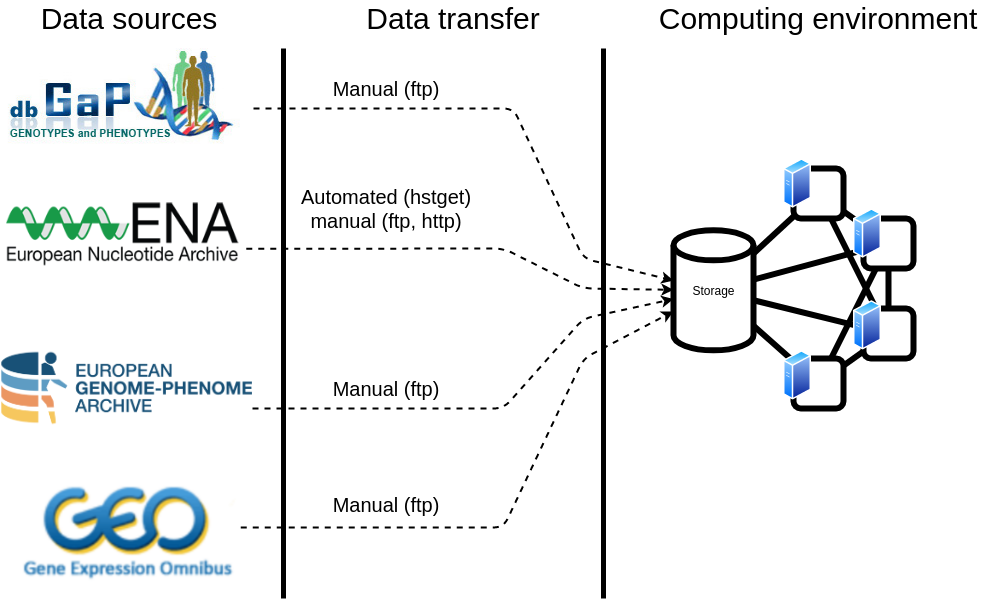
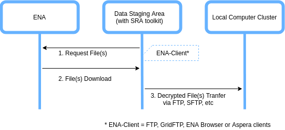
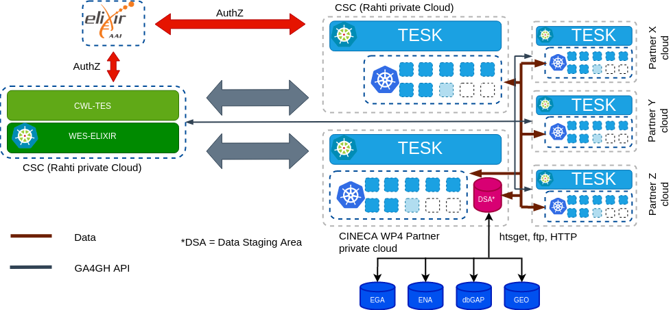
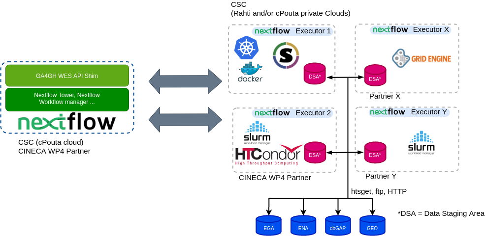

# Framework and APIs for executing federated genomics analyses

Note: the deliverable text has since been updated [in Google Docs](https://docs.google.com/document/d/1YJI3Ya5CV7g_V-Vm3xeCF0pJqpcm37zm_pCvoZydH_I).

## Table of Contents

- [Scope](#scope)
- [Background](#background)
- [Proposed Framework and APIs](#proposed-framework-and-apis)
- [Deployment Scenarios](#deployment-scenarios)
- [PoC Development and User story](#poc-development-and-user-story)

## Scope

Main scope of this deliverable is to gather technical requirements & frameworks for federated analysis platform. In work package subtask 4.3.2, the project partners have described mainly following use cases:

- Federated QTL analysis for molecular phenotypes.
- Simple Workflow Polygenic Risk Scores (PRS) across two similar ethnic background sample sets.
- Federated joint cohort genotyping

The federated analysis platform defined by this task aims in providing technological solutions for these use cases. Technical requirements are thus gathered based upon these use case descriptions. The aim of this deliverable is to write a short design document that shows the requirements and lists the different options for the solution.

## Background

As a starting point for this deliverable, a [Data Workflow Survey](#Data-Workflow-Survey) for work package partners was performed. A total of 6 work package partners participated in survey:

- HES-SO & SIB, Switzerland
- University of Tartu, Estonia
- University Medical Center Groningen (BIOS), Netherlands
- University of Oxford, UK
- University of Cape Town, South Africa
- EGA group, EMBL-EBI, UK

The survey showed that the data sources needed for the analysis varies a lot. There are four archives (see [Table 1](#table-1:-data-workflow-survey-summary)) that are used for accessing the data. However, according to the survey there are similarities in the overall architecture of computing environments used for the analysis (see [Figure 1](#figure-1:-data-workflow)). Usually the data is fetched from the data source and placed in an internal  storage system and accessed by the computing cluster. It is very rare to stream the data directly (e.g. using htsget streaming protocol) from the archive for the computation. In most cases data transfer happens using traditional transfer protocols, like http(s) or (s)ftp. Also, both the data and file types vary a lot and this limits the transfer protocols to the traditional ones. Data types include genome sequences, phenotype data and basically any other data from presentation files to text documents.

### Table 1: Data workflow survey summary

| Parameters | Responses  |
|:--------|:---|
| **Datatypes** | Genome sequences (whole genomes, exomes, chip data), phenotype data (demographics, disease status, medication), metadata, other data types (documents, presentations, images)  |
| **File formats**  | CRAM, BAM/SAM, FASTQ (data), VCF (data), TAB-delimited data (data), CSV (data), Tabix-indexes (data), DATS/DataMed (metadata) DCAT (metadata), XML (meadata)  |
| **Data storage**  | EGA (controlled access), dbGap (controlled access), ENA (open access), GEO (open access)  |
| **Transfer protocol**   |  http(s) (manual), (s)ftp (manual), Globus (manual), Aspera (manual), htsget (automated)  |
|  **Access rights**|  Per-user basis (no external access), token based (ELIXIR AAI, Switch AAI)  |

### Figure 1: Data workflow

## Proposed Framework and APIs

Based upon extensive discussion between CINECA WP4 partners on survey results, it was decided APIs of proposed solution should be compatible with [GA4GH](https://www.ga4gh.org/) cloud API standards. GA4GH's Cloud WS proposes 4 API standards that allow one to share tools/workflows (TRS), execute individual jobs on computing platforms using a standard API (TES), run full workflows on execution platforms (WES), and read/write data objects across clouds in an agnostic way (DRS). These API standards are inspired by large-scale, distributed compute projects & in theory could be developed for different computing & data archive environments. Figure 2 depicts typical functional architecture of computing ecosystem proposed by GA4GH Cloud WS.

### Figure 2: GA4GH Compatible Cloud Platform (Functional Architecture)

## Results

### dbGap: Data Access Workflow

**Prerequisites**: SRA toolkit should be installed in Data Staging Area, User must have access to the access controlled data & have access to its dbGAP repository key in Data staging area.

1. Start SRA toolkit & review its configuration. Import your dbGAP repository key in SRA toolkit & authenticate client with dbGAP.
1. dbGAP authenticates the requested access.
1. Navigate the file you want to import, select the download location on staging area & confirm import of the file.
1. SRA toolkit starts file download if file access is allowed as per RBAC policy.
1. Downloaded file in step 5 is encrypted. SRA tookit’s ‘vdb-decrypt’ utility decrypts the data.
1. Decrypted file could be transferred to local computing cluster for computation.

### EGA: Data Access Workflow

**Prerequisites**: EGA client/Java should be installed in Data Staging Area. User must have valid EGA account & access to his encryption/decryption key in the data staging area.

1. User starts EGA client in data staging area & provide its credentials & authenticate to EGA.
1. EGA authenticates the user access.
1. User can list the File(s) in Dataset(s) user has whitelisted access to.
1. EGA provide list of File(s)/Dataset(s) user has access to.
1. User requests download of File(s) &/or Dataset(s) he has access to.
1. EGA starts download of requested File(s) &/or datasets in Data staging area.
1. Data downloaded in above step is encrypted. User can decrypt downloaded using EGA client with his decryption key.
1. Decrypted data now can be transferred to local computing services.

### ENA: Data Access Workflow

**Prerequisites**: User must have supported ENA client(FTP, GridFTP, ENA browser or Aspera clients) installed in Data Staging Area. User must have valid ENA account.

1. User authenticates using one of valid ENA clients to the ENA service
1. Use is authenticated by ENA service.
1. User request for the files he want to download.
1. Files are being downloaded to the Data staging area. User can optionally check integrity of file by Md5 checksum of file.
1. Data downloaded in step 4 are in decrypted format & can be now transferred to data staging area.

## Deployment Scenarios

Following deployment scenarios for Federated Genomics analysis cloud APIs were discussed:

### Deployment Scenario 1: Federated Genomics analysis using GA4GH compatible ELIXIR Cloud APIs

Under this deployment scenario, CINECA WP4 partners can deploy a WES & TES services being developed by [ELIXIR Cloud & AAI](https://elixir-europe.github.io/cloud/) project on their infrastructure. For data access, it is assumed data is made available to data staging area within the cluster. Figure 3, depicts this deployment model where a centralized WES & federated TES endpoints are deployed CINECA WP4 wide partners.

#### Figure 3: Deployment Scenario 1

Deployment of APIs in this scenario have following dependecies:

***Docker & Kubernetes:** WES & TES services from ELIXIR Cloud & AAI project only supports Docker & Kubernetes runtime environments.

- **CWL Workflows:** Elixir Cloud & AAI APIs currently only support CWL workflow execution.

### Deployment Scenario 2: Federated Genomic Analysis using Nextflow & GA4GH Compatible Services (WES & TES)

Under this deployment scenario, CINECA WP4 partners can deploy a [Nextflow](https://www.nextflow.io/) manager (& Optionally a WES shim to make it fully compatible with GA4GH WES) which serve as WES endpoint. Nextflow executor in this scenario is [TESK](https://github.com/EMBL-EBI-TSI/TESK) which act as a TES endpoint. For data access, it is assumed data is made available to data staging area within the cluster. Figure 4, depicts this deployment model where a centralized WES (Nextflow manager) & federated TES (TESK) endpoints are deployed CINECA WP4 wide partners.

#### Figure 4: Deployment Scenario 2

Deployment of APIs in this scenario have following dependecies:

- **Kubernetes:** TESK currently only supports Kubernetes runtime enviornments.
- **Nextflow Workflows:** Nextflow manager supports only execution of Nextflow workflows .

### Deployment Scenario 3: Federated Genomic Analysis using Nextflow with multiple executors

Under this deployment scenario, CINECA WP4 partners can deploy a [Nextflow](https://www.nextflow.io/) manager (& Optionally a WES shim to make it fully compatible with GA4GH WES) which serve as WES endpoint. Nextflow executors in this scenario could be different computing environments (for ex. SLURM, SGE, Kubernetes etc.) available at CINECA WP4 partner sites. In this deployment scenario, executor environment will not be fully compatible with GA4GH TES specifications. For data access, it is assumed data is made available to data staging area within the cluster. Figure 5, depicts this deployment model where a centralized WES (Nextflow manager) & multiple nextflow executor endpoints are deployed CINECA WP4 wide partners.

#### Figure 5: Deployment Scenario 5

Deployment of APIs in this scenario have following dependencies:

- **Specific Computing Environments** Specific computing enviornments [supported](https://www.nextflow.io/docs/latest/executor.html) by Nextflow executors could be used.
- **Nextflow Workflows:** Nextflow manager supports only execution of Nextflow workflows .

## PoC Development and User story

A minimum viable Proof of Concept(PoC) is also being developed for this deliverable. Nextflow is being decided as common technology nominator among the CINECA WP4 partners, hence PoC is being developed as per **Deployment Model 2**. To ease development efforts, Data staging for workflow would be done via virtual cohort running at CSC's cPouta cloud. Table 2 lists services which are being developed & deployed as per this PoC.

### Table 2: PoC Development Details

| Endpoint | Technology  | Deployment Details|
|:--------|:---|:---|
| WES | Nextflow Manager | TBD|
| TES 1 | TESK  | Deployed at CSC's Rahti cloud|
| TES 2 | TESK  | TBD, EMBL-EBI? |
| TES X | TESK  | TBD, CINECA-WP4 Partner X? |
| Virtual Cohort | Federated EGA  | Deployed at CSC's cPouta cloud|

### PoC User Story

This PoC is being developed to support federated eQTL analysis workflow with following user story:

- User submits Nextflow workflow to WES endpoint.
- Workflow contains processes which runs private analysis on Cohort data available to specific TES endpoint(s)
- Nextflow manager delegates processes to corresponding TES endpoints.
- Private analysis is executed on corresponding TES endpoints.
- Results of analysis from different TES endpoints are then aggregated at specific TES endpoint or WES endpoint.
- Final aggregated result is made available to end user.

## Abbreviations and terminoligy

- **EGA**, European Genome-Phenome Archive.
- **dbGAP**, database of Genotypes and Phenotypes.
- **ENA**, European Nucleotide Archive
- **GEO**, Gene Expression Omnibus
- **CINECA**, Common Infrastructure for National Cohorts in Europe, Canada, and Africa
- **FTP**, file transfer protocol
- **AAI**, Authentication and Authorization Infrastructure
- **QTL**, Quantitative trait locus
- **HES-SO**, Haute école spécialisée de Suisse occidentale
- **SIB**, Swiss Institute of Bioinformatics
- **EMBL-EBI**, European Molecular Biology Laboratory, European Bioinformatics Institute
- **CRAM**, compressed columnar file format for storing biological sequences aligned to a reference sequence
- **BAM**, Binary Alignment Map
- **SAM**, Sequence Alignment Map
- **FASTQ**, text-based format for storing both a biological sequence (usually nucleotide sequence) and its corresponding quality scores. Both the sequence letter and quality score are each encoded with a single ASCII character for brevity.
- **VCF**, Variant Call Format
- **CSV**, comma separated data
- **DATS**, Data Tags Suite
- **FHIR**, Fast Healthcare Interoperability Resources
- **XML**, Extensible Markup Language
- **TES**, Task Execution Service
- **WES**, Workflow Execution Service
- **DRS**, Data repository service
- **TRS**, Tool repository service
- **CoLasus**, study is a population-based cohort of 6734 middle-aged participants from Lausanne (Switzerland)
- **PsyCoLaus** psychiatric phenotypization
- **SMPs**, Single-nucleotide polymorphism
- **CNV**, Copy number variation

## Data Workflow Survey

### Questions

1. What data sources are needed in your analysis workflows?
1. What are the data types you need in your analysis workflows?
1. How is the data ingested into your analysis workflows? What interfaces & protocols you need for transferring data from data storage to computing environment?
1. How your analysis workflow authenticates itself to data source & get access to the data?

### Answers

#### HES-SO & SIB

1. CoLaus/PsyCoLaus, EGA
1. Structured clinical data (demographics, diagnosis, prescription); sequences (variants such SNPs, CNV); general research data (pdf, ppt, images, narratives, ...).
1. For meta-data: DATS/DataMed or DCAT. For data: FHIR, csv, ...
1. For EGA, Elixir AAI. For other, Switch AAI (Switzerland)

#### University of Tartu

1. We use data from various sources. Some of the data are stored locally on the network file system of our high performance computing center, but we also routinely use data from public (European Nucleotide Archive (ENA), Gene Expression Omnibus (GEO)) and controlled access (dbGaP, EGA, Synapse, Google Cloud) repositories.
1. We primarily use three types of data:
- Genotype data (various file formats that need to be harmonized to a common VCF format before it can be used).
- RNA sequencing data (mostly in fastq format, dbGAP, GEO and EGA also use other formats (.cram, .bam, .sra).
- Public references datasets (reference genome sequence, gene annotations, aligner index files, etc)
1. We currently transfer the data manually to our local compute environment, convert to uniform file format (all RNA-seq data to fastq format and all genotype data to VCF format using the same reference genome coordinates). Our computation workflow accesses the data from our local network drive. Automating this in the general case can be challenging due to different access control mechanisms (dbGaP, EGA, Synapse, ad-hoc sFTP sites), file formats (.fastq, .sra, .bam, .cram) and incomplete sample metadata (especially a problem with EGA).
1. The data are first downloaded manually to a local network drive.

#### University Medical Center Groningen (BIOS)

1. Our data sources are hosted on our local compute cluster. The BIOS data has been generated by multiple Dutch Universities, from their respective biobanks (LifeLines, Leiden Longevity study, Rotterdam Study, Dutch Twin Registry). Public resources are used for follow-up analyses (e.g. interpretation of results), including data from SRA/ENA, GEO, and other datasets.
1. We primarily use three types of data:
- Genotype data (various file formats that need to be harmonized to a common VCF format before it can be used). Our current software uses an in-house developed representation of these genotypes (TriTyper). Genotype data is generally collected from genotype arrays, and subsequently HRC imputed. If represented as VCF files, they are indexed using tabix.
- RNA sequencing data (mostly in fastq format), or tab-separated flat text tables containing counts, including all study individuals.
- Public references datasets (reference genome sequence, gene annotations, aligner index files, etc)
- Optionally, cell count data (e.g. number of different kinds of white blood cells) and other sample meta-data (e.g. batch, lane, etc) to correct for confounding factors.
1.We currently transfer the data manually to our local compute environment, convert to uniform file format. Our eQTL mapping approach uses the in-house, binary TriTyper format for genotype input, and tab-separated flat text count files as input for RNA-seq data. Our computation workflow accesses the data from our local network drive. No explicit APIs or protocols are currently being employed.
1. Access rights are assigned on a per-user basis on our compute cluster. No access from external parties is available.

#### University of Oxford

1. Multiple data sources are used some public, some controlled access but most data comes directly from individual cohorts as part of wider consortia efforts
1. Genotype data and phenotype data, in various formats appropriate for the selected analysis programs, usually VCF for genotype data, tab delimited tables for phenotypes
1. Data are manually transferred to the local computing environment. Data transfer both internally and externally usually sftp
1. Data are local to the workflow on the attached file system

#### University of Cape Town, South Africa

1. Multiple data sources from different H3Africa projects across the continent. The datasets are hosted in institution local machines or clusters. Datasets can also be accessed via access controlled via EGA.
1. Genotype data including both sequence and chip data, phenotype data (demographics, disease status, medication...)
1. Data are ingested manually to computing clusters using sftp and globus online.
1. Data are local to the workflows to authenticated users and. No external access interface available for data access.
