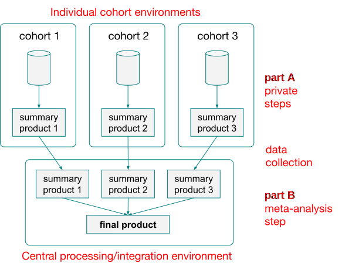

# Pipelines for federated genomic analysis

This section provides the demonstrator technical implementations of pipelines for federated genomic analysis. It follows the general framework for federated analysis adopted by CINECA WP4.

## Background
The general approach for each use case is to split the analysis pipeline into two parts:
* Part A of the pipeline can in principle be run in the environments of the appropriate cohorts and reduces private, individual level data to intermediate summary level products.
* The results of the analysis from different cohorts are collected at a central location.
* Part B of the pipeline aggregates the summary level products into the final scientific product, which is made available to the end user.

This can be demonstrated with the following figure:

Part A and Part B of the pipelines have to be workflows written in [Nextflow](https://www.nextflow.io/).

## Environments for running the pipelines
Thanks to Nextflow versatility, the pipelines designed in this way are able to support a variety of scenarios and can run in most existing computing environments. Please see the instructions for running them on:
* [TESK](environments/tesk.md)
* [SLURM](environments/slurm.md)
* [LSF](environments/lsf.md)

See also [additional technical considerations](docs/nextflow-technical-considerations.md) regarding Nextlow, specifically about how to build it from source if necessary.

### Note on portability

In the modern world, true portability is not feasible without including some sort of containerisation layer. The pipelines developed by CINECA WP4 use Docker images for supplying their dependencies. Hence, each environment attempting to run these pipelines will need to support either Docker or Singularity (to which Docker images can be transparently converted).

## Demonstrators
Example implementations of the proposed approach include:
* [4.3.1. Joint cohort genotyping](demonstrators/4.3.1-genotyping)
* [4.3.3. eQTL analysis](demonstrators/4.3.3-eqtl)
