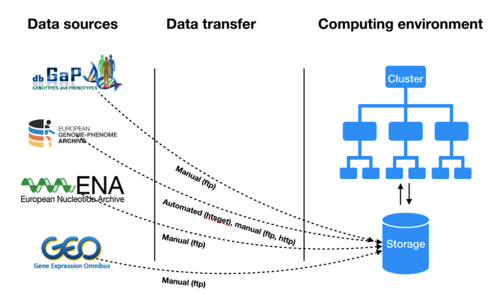

# CINECA Cloud WP D4.2: Framework and APIs for executing federated genomics analyses

## Scope
Main scope of this deliverable is to gather technical requirements & frameworks for federated analysis platform. In work package subtask 4.3.2, the project partners have described mainly two use cases: 
* Federated QTL analysis for molecular phenotypes, and 
* Simple Workflow Polygenic Risk Scores (PRS) across two similar ethnic background sample sets.

The federated analysis platform defined by this task aims in providing technological solutions for these use cases. Technical requirements are thus gathered based upon these use case descriptions. The aim of this deliverable is to write a short design document that shows the requirements and lists the different options for the solution. 

## Background

As a starting point for this deliverable, a Data Workflow Survey for work package partners. Total 6 work package partners participated in survey. The survey showed that the data sources needed for the analysis varies a lot. There are four archives (see [Table 1](#table-1:-data-workflow-survey-summary)) that are used for accessing the data. However, according to the survey there are similarities in the overall architecture of computing environments used for the analysis (see [Figure 1](#figure-1:-data-workflow)). Usually the data is fetched from the data source and placed in an internal  storage system and accessed by the computing cluster. It is very rare to stream the data directly (e.g. using htsget streaming protocol) from the archive for the computation. In most cases data transfer happens using traditional transfer protocols, like http(s) or (s)ftp. Also, both the data and file types vary a lot and this limits the transfer protocols to the traditional ones. Data types include genome sequences, phenotype data and basically any other data from presentation files to text documents.
### Table 1: Data workflow survey summary

| Parameters | Responses  |
|:--------|:---|
| **Datatypes** | Genome sequences (whole genomes, exomes, chip data), phenotype data (demographics, disease status, medication), metadata, other data types (documents, presentations, images)  |
| **File formats**  | CRAM, BAM/SAM, FASTQ (data), VCF (data), TAB-delimited data (data), CSV (data), Tabix-indexes (data), DATS/DataMed (metadata) DCAT (metadata), XML (meadata)  |
| **Data storage**  | EGA (controlled access), dbGap (controlled access), ENA (open access), GEO (open access)  |
| **Transfer protocol**   |  http(s) (manual), (s)ftp (manual), Globus (manual), Aspera (manual), htsget (automated)  |
|  **Access rights**|  Per-user basis (no external access), token based (ELIXIR AAI, Switch AAI)  |
### Figure 1: Data workflow

