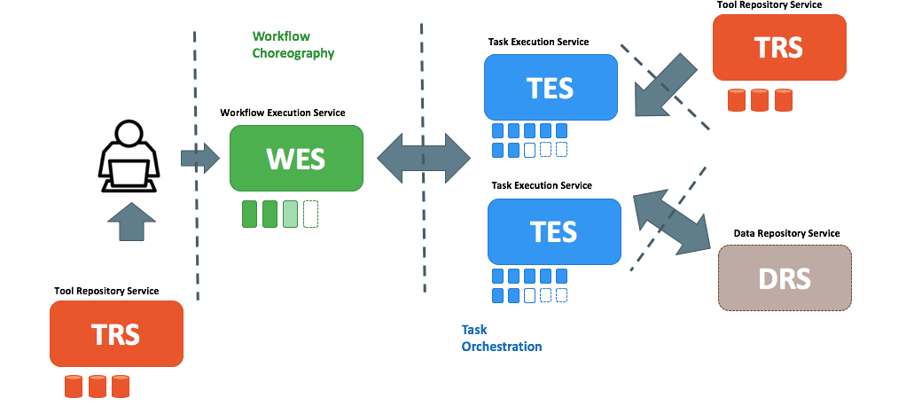
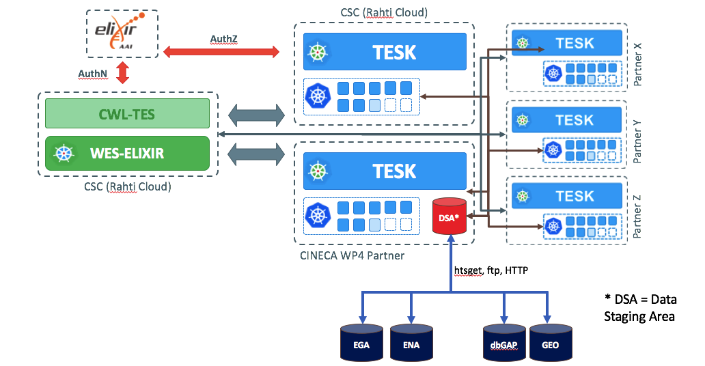
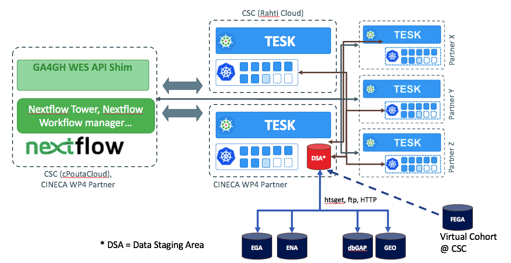
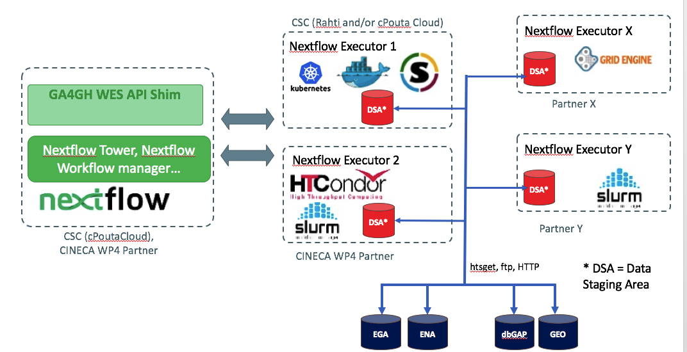

# CINECA Cloud WP D4.2: Framework and APIs for executing federated genomics analyses

## Table of Contents
- [Scope](#scope)
- [Background](#background)
- [Proposed Framework and APIs](#proposed-framework-and-apis)
- [Deployment Scenarios](#deployment-scenarios)
- [PoC Development and User story](#poc-development-and-user-story)

## Scope
Main scope of this deliverable is to gather technical requirements & frameworks for federated analysis platform. In work package subtask 4.3.2, the project partners have described mainly two use cases: 
* Federated QTL analysis for molecular phenotypes, and 
* Simple Workflow Polygenic Risk Scores (PRS) across two similar ethnic background sample sets.

The federated analysis platform defined by this task aims in providing technological solutions for these use cases. Technical requirements are thus gathered based upon these use case descriptions. The aim of this deliverable is to write a short design document that shows the requirements and lists the different options for the solution. 

## Background

As a starting point for this deliverable, a Data Workflow Survey for work package partners. Total 6 work package partners participated in survey. The survey showed that the data sources needed for the analysis varies a lot. There are four archives (see [Table 1](#table-1:-data-workflow-survey-summary)) that are used for accessing the data. However, according to the survey there are similarities in the overall architecture of computing environments used for the analysis (see [Figure 1](#figure-1:-data-workflow)). Usually the data is fetched from the data source and placed in an internal  storage system and accessed by the computing cluster. It is very rare to stream the data directly (e.g. using htsget streaming protocol) from the archive for the computation. In most cases data transfer happens using traditional transfer protocols, like http(s) or (s)ftp. Also, both the data and file types vary a lot and this limits the transfer protocols to the traditional ones. Data types include genome sequences, phenotype data and basically any other data from presentation files to text documents.
#### Table 1: Data workflow survey summary

| Parameters | Responses  |
|:--------|:---|
| **Datatypes** | Genome sequences (whole genomes, exomes, chip data), phenotype data (demographics, disease status, medication), metadata, other data types (documents, presentations, images)  |
| **File formats**  | CRAM, BAM/SAM, FASTQ (data), VCF (data), TAB-delimited data (data), CSV (data), Tabix-indexes (data), DATS/DataMed (metadata) DCAT (metadata), XML (meadata)  |
| **Data storage**  | EGA (controlled access), dbGap (controlled access), ENA (open access), GEO (open access)  |
| **Transfer protocol**   |  http(s) (manual), (s)ftp (manual), Globus (manual), Aspera (manual), htsget (automated)  |
|  **Access rights**|  Per-user basis (no external access), token based (ELIXIR AAI, Switch AAI)  |
#### Figure 1: Data workflow

## Proposed Framework and APIs
Based upon extensive discussion between CINECA WP4 partners on survey results, it was decided APIs of proposed solution should be compatible with [GA4GH](https://www.ga4gh.org/) cloud API standards. GA4GH's Cloud WS proposes 4 API standards that allow one to share tools/workflows (TRS), execute individual jobs on computing platforms using a standard API (TES), run full workflows on execution platforms (WES), and read/write data objects across clouds in an agnostic way (DRS). These API standards are inspired by large-scale, distributed compute projects & in theory could be developed for different computing & data archive enviornments. Figure 2 depicts typical functional architecture of computing ecosystem proposed by GA4GH Cloud WS.
#### Figure 2: GA4GH Compatible Cloud Platform (Functional Architecture)

## Deployment Scenarios

Following deployment scenarios for Federated Genomics analysis cloud APIs were discussed:

### Deployment Scenario 1: Federated Genomics analysis using GA4GH compatible ELIXIR Cloud APIs
Under this deployment scenario, CINECA WP4 partners can deploy a WES & TES services being developed by [ELIXIR Cloud & AAI](https://elixir-europe.github.io/cloud/) project on their infrastructure. For data access, it is assumed data is made available to data staging area within the cluster. Figure 3, depicts this deployment model where a centralized WES & federated TES endpoints are deployed CINECA WP4 wide partners.
#### Figure 3: Deployment Scenario 1

Deployment of APIs in this scenario have following dependecies:
* **Docker & Kubernetes:** WES & TES services from ELIXIR Cloud & AAI project only supports Docker & Kubernetes runtime enviornments.
* **CWL Workflows:** Elixir Cloud & AAI APIs currently only support CWL workflow execution.

### Deployment Scenario 2: Federated Genomic Analysis using Nextflow & GA4GH Compatible Services (WES & TES)
Under this deployment scenario, CINECA WP4 partners can deploy a [Nextflow](https://www.nextflow.io/) manager (& Optionally a WES shim to make it fully compatible with GA4GH WES) which serve as WES endpoint. Nextflow executor in this scenario is [TESK](https://github.com/EMBL-EBI-TSI/TESK) which act as a TES endpoint. For data access, it is assumed data is made available to data staging area within the cluster. Figure 4, depicts this deployment model where a centralized WES (Nextflow manager) & federated TES (TESK) endpoints are deployed CINECA WP4 wide partners.
#### Figure 4: Deployment Scenario 2

Deployment of APIs in this scenario have following dependecies:
* **Kubernetes:** TESK currently only supports Kubernetes runtime enviornments.
* **Nextflow Workflows:** Nextflow manager supports only execution of Nextflow workflows .

### Deployment Scenario 3: Federated Genomic Analysis using Nextflow with multiple executors
Under this deployment scenario, CINECA WP4 partners can deploy a [Nextflow](https://www.nextflow.io/) manager (& Optionally a WES shim to make it fully compatible with GA4GH WES) which serve as WES endpoint. Nextflow executors in this scenario could be different computing enviornments (for ex. SLURM, SGE, Kubernetes etc.) available at CINECA WP4 partner sites. In this deployment scenario, executor enviornment will not be fully compatible with GA4GH TES specifications. For data access, it is assumed data is made available to data staging area within the cluster. Figure 5, depicts this deployment model where a centralized WES (Nextflow manager) & multiple nextflow executor endpoints are deployed CINECA WP4 wide partners.
#### Figure 5: Deployment Scenario 5

Deployment of APIs in this scenario have following dependecies:
* **Specific Computing Enviornments** Specific computing enviornments [supported](https://www.nextflow.io/docs/latest/executor.html) by Nextflow executors could be used.
* **Nextflow Workflows:** Nextflow manager supports only execution of Nextflow workflows .

## PoC Development and User story

A minimum viable Proof of Concept(PoC) is also being developed for this deliverable. Nextflow is being decided as common technology nominator among the CINECA WP4 partners, hence PoC is being developed as per **Deployment Model 2**. To ease development efforts, Data staging for workflow would be done via virtual cohort running at CSC's cPouta cloud. Table 2 lists services which are being developed & deployed as per this PoC.

#### Table 2: PoC Development Details

| Endpoint | Technology  | Deployment Details|
|:--------|:---|:---|
| WES | Nextflow Manager | TBD|
| TES 1 | TESK  | Deployed at CSC's Rahti cloud|
| TES 2 | TESK  | TBD, EMBL-EBI? |
| TES X | TESK  | TBD, CINECA-WP4 Partner X? |
| Virtual Cohort | Federated EGA  | Deployed at CSC's cPouta cloud|

### PoC User Story
This PoC is being developed to support federated eQTL analysis workflow with following userstory:
* User submits Nextflow workflow to WES endpoint. 
* Workflow contains proccesses which runs private analysis on Cohort data available to specific TES endpoint(s)
* Nextflow manager delegates processes to corresponding TES endpoints.
* Private analysis is executed on corresponding TES endpoints.
* Results of analysis from different TES endpoints are then aggregated at specific TES endpoint or WES endpoint.
* Final aggregated result is made available to end user.

