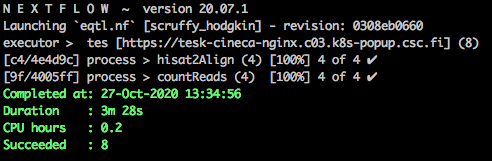

# Simple demonstrator pipeline for eQTL analysis

## Execution using the TES endpint

First, perform the actions described in the parent README file: log in to the Kubernetes pod and set up the necessary environment variables.

Download the example HISAT2 index and reference GTF file from here: https://www.dropbox.com/sh/eko17f1b5azsnxn/AAD7BmX-gHzRDeV2R0fpud1ba?dl=0.

Run the workflow:
```bash
nextflow eqtl.nf \
  --studyFile study_file.txt \
  --hisat2_index hisat2_index/hisat2_index \
  --gtf_file Homo_sapiens.GRCh38.91.chr21.gtf \
  -with-docker nfcore/rnaseq:1.4.2
```

It should take up to 5–10 minutes to execute, and the results should appear as four `*.counts` files in the `result/` subdirectory.

Successful execution should look something like this:



To verify the output, we can check how many RNA-seq reads overlap the PFKL gene (ENSG00000141959) in the eipl_A sample.

```bash
/mnt/wp4-federated-joint-cohort-analysis/nextflow_TES/eqtl_workflow $ grep ENSG00000141959 results/eipl_A.counts | cut -f 7
9314
```

## Execution with SLURM at University of Tartu HPC

We can also execute the same workflow at [University of Tartu HPC](https://hpc.ut.ee/en/home/) using the SLURM execution system. 

```bash
nextflow eqtl.nf \
  --studyFile study_file.txt \
  --hisat2_index hisat2_index/hisat2_index \
  --gtf_file Homo_sapiens.GRCh38.91.chr21.gtf \
  -with-singularity nfcore/rnaseq:1.4.2 \
  -process.executor slurm \
  -process.queue main
```

Note that we had to replace `-with-docker` with `-with-singularity`, because Docker is not supported in that environment. We also had to specify the executor and the name of the queue. 

To verify the output, we can check how many RNA-seq reads overlap the same gene as in the TES example.

```bash
(base) [a72094@rocket eqtl_workflow]$ grep ENSG00000141959 results/eipl_A.counts | cut -f 7
9314
```

We note that in both cases we detected the same number of reads, indicating that the workflow has executed successfully on both environments.
